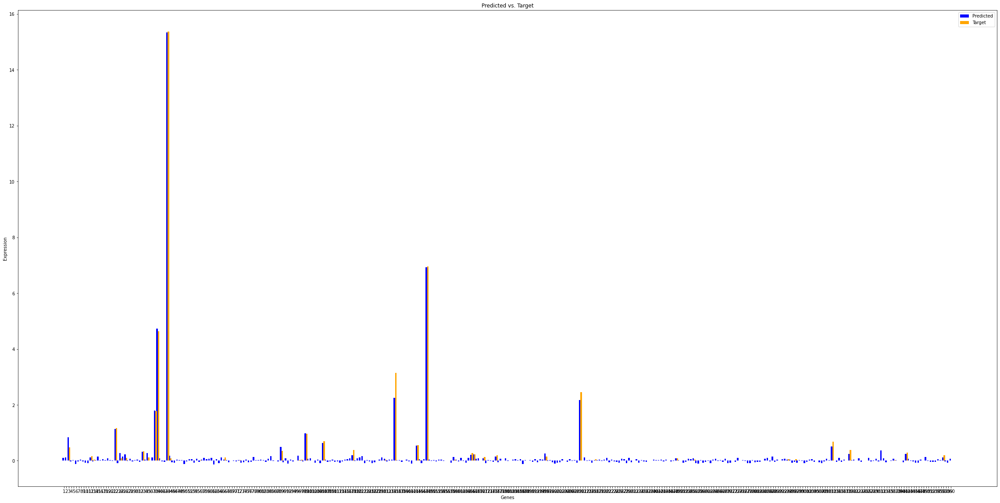

# Gene-Expression-Prediction-Using-Deep-Neural-Network
Gene Expression Prediction Using Deep Neural Network employing information about hiddenness of regulatory elements of DNA

## Introduction

In this project, I have tried to predict the expression of genes of a sample using the information about its regulatory regions through the ATACseq data on that sample. 

## Data

The data (ATACseq) was obtained from the ENCODE website: https://www.encodeproject.org/. 
The human genes' data was downloaded from the Ensembl website: https://ensembl.org/.
The RNAseq data wasnt downloaded in a processed form, though it was still obtained from the ENCODE website. The raw fastq files were downloaded and they were processed by Kallisto (https://github.com/pachterlab/kallisto) to obtain the transcript abundances. This pipeline was implemented on Nextflow (https://www.nextflow.io/) for better scalability.

## Methodology

I have focused on a certain region of interest (first million base pairs in chromosome 1) just as a proof of concept, but it can easily be extended to the whole genome. First, using data from the Ensembl database about human genes, I identified the genes present in this region of interest (There were 360 of them). Then, I have divided that region into bins of length 1000 length, so for a million bases, there were 1000 such bins. Then, for each bin in each sample (tissue-type or cell-line), I have identified if there is any ATACseq peak within any bin. If that is true, the bin is set to 1 else 0. Then, for those 360 genes in the region of interest, using the RNAseq data of the sample, I found their expression levels (TPM). Then, I just used PyTorch to make a simple Deep Neural Network with one hidden layer with 500 nodes (input layer had 1000 nodes, and output had 360) to understand this behaviour between which bins (regulatory regions) were active and what was the expression of the genes. The loss used was Mean Squared Error and after 1000 epochs of training, the loss came out to be around 0.032. 

## Results

Expression levels of the 360 genes, the target levels and the levels predicted by the model:

## Limitations/Challenges

The biggest limitation of this project as of now is the lack of datapoints. The analysis right now is limited to just aroun 50 tissue-types/cell-lines with both ATACseq and RNAseq data which were available in the ENCODE website. This limitation of less data is linked to the fact that I have assumed the RNAseq and ATACseq outputs of all the cells from a tissue-type (and all the cells of a certain cell-line) to be similar, hence assumed to be same sample. Since there are only so many broad categories of tissues or cell-lines, this assumption can never come with a large amount of data. If I would need a lot of data, then I need to have RNAseq and ATACseq data from the same sample (tissue or cell), and since this can be for any number of samples, then the data will not be (at least theoretically) limited.

## References

- ENCODE- https://www.encodeproject.org/
- Ensembl- https://ensembl.org/
- Kallisto- https://github.com/pachterlab/kallisto
- Nextflow- https://www.nextflow.io/