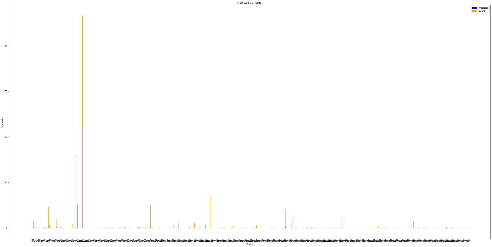

In this project, I will train a deep neural network capable of predicting gene expression using information from the ATACseq analysis on similar sample (tissue type or cell type).

(12-22-23)

First I need to collect lots of data (download many RNAseq and ATACseq files for different tissues and celltypes from ENCODE).

I have downloaded data (RNAseq tsv file and ATACseq bed file) from 10 cell lines and  19 tissue types. I can also download data of primary cells but that I will do later. For now, I will try to make the model work.

First, I will write code to get all the data in a nice file/s, which will be the training and testing data. First, I need to think how I will organise the many possible peak regions in all the different samples. I am thinking of splitting the region of interest (first million bases of chr1) into bins of 1000 size and for each bin, I will calculate: size of the peak*its score and add this for all the peaks associated with a bin (through midpoint lying within bin). This way, I will get overall openness of each bin. For the genes (output), first I need to find all the genes present in our area of interest from the gene-info file obtained from ensembl in the integration project. Then, we will just limit our analysis to these genes. I would need to make sure that all these genes are present in each tsv file (but I am pretty sure they will be).

So I realized that the score column in the bed file is the actual marker for goodness of a peak. So I am gonna change the bin-scoring-method stated above slightly. I will first filter only the peaks with a score of 1000, as they are the strongest ones. Then, for each bin, for each sample, there will be either some (1000 scored) peak in it or not (doesn't matter if there are more than one peaks in the bin). We will treat each bin to have binary value in the input, i.e. it has a peak or not. 

(12-23-23)

I realized later yesterday that for a region of interest of the first million bases of chromosome 1, with each bin of size 1000, there would be 1000 nodes in the input layer in the neural network and 360 nodes in the output layer (as that is the number of genes in that area of interest). And the number of data points we have are in two digits, so very less. A good thing is that each input will be 0 or 1, so some possibilities are reduced that way.

Also, I can show the prediction results in the form of a plot, showing the actual expression values of each gene and our predictions for them.

Wrote the code for making the input and output files for the model and stored them in the prepared_data folder. 

Then moved on to finally writing code for the model using PyTorch. But first installed pytorch. Also tried to understand from ChatGPT about a PyTorch model implementation and meaning of every line in that.

(12-24-23)

Continuing on understanding the Pytorch model implementation. 

I have decided that I will submit the Genentech application today, and keep on understanding the model implementation till later days.. Update after 8 hours- not today but probably tomorrow

Current issue- somehow in the input tensor, the entries are double, but the output = model(input_tensor) command expects the inputs to be float. Need to figure that out.

Figured that out, and the model is working now. Now need to see how good is the training. Can do this by plotting the values of gene expressions and what the predicted expressions are after the data goes through the model.

(12-25-23)

Okay, so I have been able to successfully create the output for the model (its predictions vs expected values of gene expressions). The first output is, as expected not very good. It looks like:

Now, I need to think of what would be the best ways to improve the predictions of the model and also how to quantify the quality of its output. Something like correlation comes to my mind, but i will inquire more about it.

So doing like 10000 epochs improved my training accuracy (it had to do that). Currently, the model is probably overfitted. I need to check how well it generalizes to other data that I have.

## Objective 2- Learning Preprocessing

(12-30-23)

Trying to mimic the processing of the raw fastq files, to obtain as close as possible processed files to the ones obtained from ENCODE. Once the whole preprocessing pipeline is decided upon/understood, I will go on to properly implement it using Nextflow (I have learnt its basics). 

There are many steps in the processing. I am gonna focus on obtaining the gene quantifications initially (as that is what I have used as input in the DL model), and the steps in that as shown in the Association Graph for the experiment/s in ENCODE is:

- Aligning reads with reference genome and QA (Quality Assesment) calculation
- Using RSEM for gene quantifications (also needs genome index file as input)

make STARforMacStatic CXXFLAGS_SIMD="" CXX=/opt/homebrew/opt/gcc/bin/g++-13

make STARforMacStatic CXXFLAGS_SIMD="-march=native" CXX=/opt/homebrew/opt/gcc/bin/g++-13

not able to compile STAR because of ARM architecture of my cpu. Tomorrow will try using rosetta 2

(12-31-23)

Actually, it appears that I can use the precompiled STAR file (inside STAR-2.7.11a/bin/MacOSX_x86_64) on my ARM mac, probably because of Rosetta (I believe it is installed as this thing checked out (https://apple.stackexchange.com/questions/427970/how-to-tell-if-m1-mac-has-rosetta-installed)).

So, I am gonna try to do the alignment using the pre-compiled binary (Downloads/STAR-2.7.11a/bin/MacOSX_x86_64).

STAR --genomeDir genome \
--readFilesIn raw_data/ENCFF696ETL.fastq.gz \
--readFilesCommand zcat

Okay, so i cannot use the genome index from the ENCODE website straight as there are a few more files related to it which are made while creating the genome index. I probably need to build the index myself. And for that, I will need 100gb of disk space. And for that, I will need to empty my hard-drive. To build the genome index, the GTF and the genome sequencing file (fasta/fastq) are required. So the next step will be to download these files and arrange for space (in the hard-drive probably). 

(1-1-24)

I emptied my harddrive after taking backup in my cmu gdrive, what i thought was important in the harddrive.

(1-2-24)

Now, I have to proceed with making the genome index. For this, I required 100gb of space and hence will do this in my harddrive. I will use STAR to do this. But first, I need to download the human genome fasta and corresponding GTF file.

Following command was used (from location of harddrive) to make the genome index file/s.

STAR --runMode genomeGenerate \
--genomeDir genome_index \
--genomeFastaFiles GRCh38_latest_genomic.fna \
--sjdbGTFfile GRCh38_latest_genomic.gff 

ran this command at 12:40. Lets see how long it takes to execute. After around 15 minutes, deciding to change --runThreadN to 8.

STAR --runThreadN 8 \
--runMode genomeGenerate \
--genomeDir genome_index \
--genomeFastaFiles GRCh38_latest_genomic.fna \
--sjdbGTFfile GRCh38_latest_genomic.gff 

Apparently STAR requires 30gb of RAM at-least. So this command will take infinetely long in my PC with miniscule 8gb RAM. So, I need to figure out something else. I can actually find the prebuilt genome index (and all related files) on the net, but probably the aligning later would also require 30gb RAM, so need another solution. So possible ideas are:

- use AWS instances for more RAM and compute the results on it.
- try to find the CMU services for such tasks.
- use Kallisto as it doesnt perform actual alignment, but pseudoalignment (still i think good results) and also requires way less RAM (8GB suffices).

I will probably go for second option- Kallisto. I set up kallisto, which involved downloading a prebuilt human kallisto index file, and running the kallisto quant by supplying the fastq of the tissue reads. The -l and -s flags are the "fragment" mean length and std deviation. Fragment means transcript and not read, and this value can be estimated by using a GTF file or by using bam file and the picard tool (but i dont have a bam file). For now I will use random values (180 and 20, which were in webpage by default).

kallisto quant -i index.idx -o output -b 100 --single -l 180 -s 20 ENCFF696ETL.fastq.gz

index is outdated (was created by an older version of kallisto), hence need to create my own. Okay, so I didnt actually need to create my own index file. Initially I donwloaded the index file using the command specified in the repository, but that was outdated. The updated one was in the link specified in the Intro of the Readme of the repository. Final command which worked-

kallisto quant -i human_index_standard/index.idx -o output -b 100 --single -l 180 -s 20 ENCFF696ETL.fastq.gz. 

Conclusions for the day: need more resources (RAM) for STAR and RSEM. Kallisto much better tool- faster and with comparable results. However, I wanted to try out Nextflow pipeline making, and I think the whole pipeline has reduced to just one step with Kallisto, so how do make a pipeline of it?

Also, for the ATACseq data, apparently there are a bit more steps. Kallisto will probably not be a good choice for ATACseq (Kallisto is specifically made for RNAseq data processing). 

So, I can try that next- see what are the tools and how many of those can be run on my pc and if there is a pseudo-aligner type thing for ATACseq data too.

